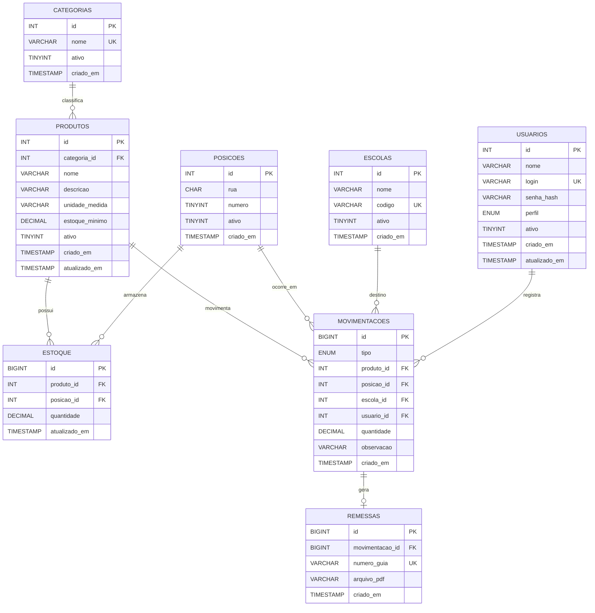

# Modelo físico do banco de dados

O arquivo [`schema.sql`](schema.sql) contém o DDL executável do banco MySQL.

## Regras físicas relevantes

- As posições são únicas pelo par `rua + numero`.
- O mapa possui as Ruas **A a G** e as posições **1 a 40**, totalizando **280 posições**.
- O estoque não aceita quantidade negativa.
- Cada combinação `produto + posição` é única na tabela de estoque.
- Uma movimentação de saída pode estar vinculada a uma escola de destino.
- Uma movimentação pode gerar no máximo uma guia de remessa.
